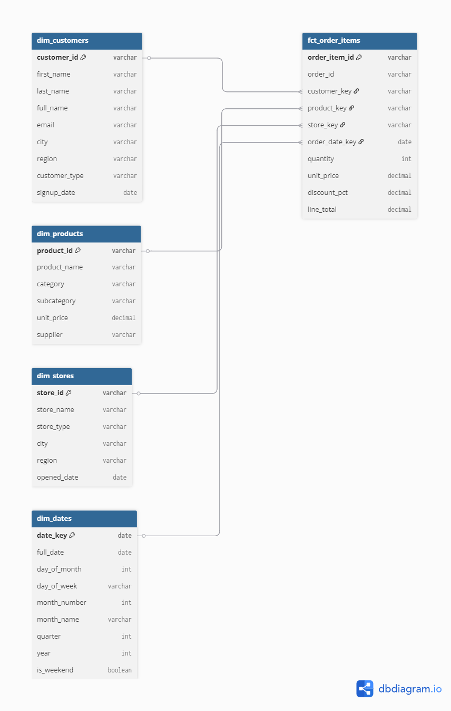

# Retail Analytics Pipeline

An end-to-end analytics engineering project. Takes messy raw retail data, loads it into PostgreSQL, profiles it for quality issues, and transforms it into a clean star schema using dbt.

Built this as a practical project to tie together SQL, dimensional modelling, and dbt Core in a realistic scenario.

## What this does

A UK-based retail company has data spread across 8 source systems: customers, products, stores, orders, order line items, payments, inventory, and web activity. The data has all the usual problems you'd find in real systems: duplicates, orphaned keys, inconsistent formats, nulls, and garbage values.

This project:
- Loads ~24,000 records across 8 CSV files into a PostgreSQL `raw` schema
- Profiles every table for quality issues (found 27 across the dataset)
- Builds a dbt project with staging models that clean, deduplicate, and standardise the data
- Transforms it into a star schema with 4 dimension tables and 2 fact tables
- Adds generic and custom dbt tests to catch regressions
- Documents everything for lineage tracking via dbt docs

## Star schema



The fact table (`fct_order_items`) sits at the order line item grain: one row per product per order. It connects to four dimensions: customers, products, stores, and dates.

A second fact table (`fct_payments`) tracks payment transactions at the individual payment level, supporting split payment analysis and payment method breakdowns.

## Project structure

```
retail_analytics/
├── models/
│   ├── staging/
│   │   ├── _stg_sources.yml           # source definitions for all 8 raw tables
│   │   ├── _stg_models.yml            # staging model docs + tests
│   │   ├── stg_customers.sql          # dedup, trim, validate emails
│   │   ├── stg_products.sql           # standardise categories, filter bad prices
│   │   ├── stg_stores.sql             # cast dates, flag future stores
│   │   ├── stg_orders.sql             # dedup, filter future dates
│   │   ├── stg_order_items.sql        # filter zero qty, handle negative discounts
│   │   ├── stg_payments.sql           # dedup, map junk payment methods
│   │   ├── stg_inventory.sql          # parse mixed date formats, zero neg stock
│   │   └── stg_web_activity.sql       # filter bots, exclude bad timestamps
│   └── marts/
│       ├── _marts_models.yml          # mart model docs + referential integrity tests
│       ├── dim_customers.sql          # enriched with order stats + lifetime spend
│       ├── dim_products.sql           # with price tier classification
│       ├── dim_stores.sql             # clean passthrough with future flag
│       ├── dim_dates.sql              # date spine 2020-2026
│       ├── fct_order_items.sql        # line-level revenue fact
│       └── fct_payments.sql           # payment transaction fact
├── tests/
│   ├── assert_no_negative_prices.sql
│   ├── assert_valid_email_format.sql
│   ├── assert_payment_after_order.sql
│   └── assert_no_future_order_dates.sql
├── data/                              # source CSVs
├── docs/                              # star schema diagram, profiling report
└── dbt_project.yml
```

## Data quality issues found

Every source table had problems. The worst ones:

| Table | Issue | Why it matters |
|-------|-------|----------------|
| customers | Duplicate PK (CUST-0003) | Inflates customer counts and spend totals |
| products | Negative prices (~4 rows) | Breaks revenue calculations |
| products | Inconsistent categories ('Electronics' vs 'Electornics') | Fragments category reporting |
| orders | ~30 orphaned customer_ids | Lost in inner joins to dim_customers |
| orders | Duplicate PK (ORD-00050) | Double-counts orders |
| payments | ~90 mismatched amounts vs order totals | Revenue reconciliation fails |
| inventory | ~15% mixed date formats (DD/MM/YYYY, MM-DD-YYYY) | Date parsing errors |
| web_activity | ~2% bot traffic (Googlebot, AhrefsBot) | Skews conversion metrics |

Full profiling report is in `docs/Raw_Data_Profiling_Report.docx`.

## KPIs supported

Once the staging layer cleans the data, the star schema supports:

- **Total Revenue** - SUM(quantity * unit_price * (1 - discount/100))
- **Order Count** - COUNT(DISTINCT order_id) for completed orders
- **AOV** - Revenue / Order Count
- **Customer Lifetime Value** - Total spend per customer
- **Repeat Purchase Rate** - Customers with 2+ orders / all customers
- **Revenue by Channel** - Online vs physical store split
- **Revenue by Category** - Product category breakdown
- **Conversion Rate** - Purchase events / unique web sessions

## Materialisation strategy

- **Staging models → views**: lightweight, always reflect current raw data, no storage overhead
- **Mart models → tables**: pre-computed for faster queries, involve joins and calculations that benefit from materialisation

## How to run

Requires PostgreSQL and dbt Core with the postgres adapter.

```bash
# load raw data
psql -U postgres -f data/load_to_postgres.sql

# install dbt postgres adapter
pip install dbt-postgres

# configure connection in ~/.dbt/profiles.yml
# (see profiles_example.yml)

# run the pipeline
dbt debug          # check connection
dbt run            # build all models
dbt test           # run all tests
dbt docs generate  # generate documentation
dbt docs serve     # view DAG + docs at localhost:8080
```

## Tools used

- **PostgreSQL 18** - raw data warehouse
- **dbt Core 1.11** - transformation layer
- **SQL** - profiling, cleaning, modelling
- **dbdiagram.io** - schema design

